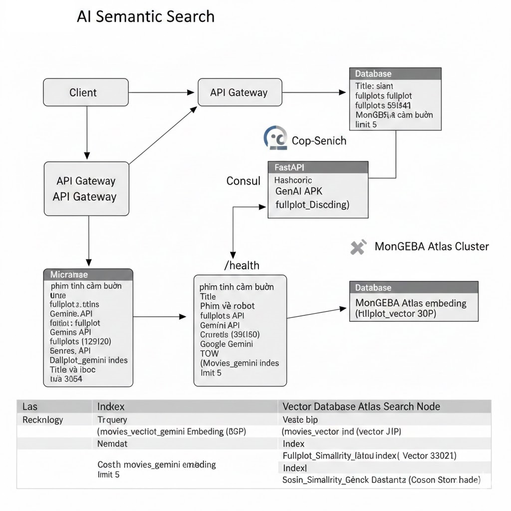

= Technical Portfolio: AI-Powered Semantic Search Microservice
:author: Masterhuthiu
:revnumber: v1.1
:toc: left
:toclevels: 3
:icons: font
:sectnums:
:stem: latexmath

== 1. Executive Summary
This project features a high-performance **Microservice** designed for semantic movie discovery. Unlike traditional lexical search, this system leverages **Large Language Models (LLMs)** to understand user intent and context, providing highly relevant results even when keywords do not match exactly.

* **Core Innovation:** Text-to-Vector transformation using Google Gemini.
* **Search Paradigm:** K-Nearest Neighbors (KNN) via Vector Search.
* **Target Data:** MongoDB `sample_mflix` dataset (20k+ documents).

== 2. Technical Architecture

The architecture follows a modern **Cloud-Native** pattern, decoupled for scalability and resilience.

=== 2.1 Component Breakdown
[cols="1,3"]
|===
|Component |Description

|**Service Layer** |Developed with **FastAPI**, providing asynchronous I/O and automatic OpenAPI documentation.
|**Inference Engine** |**Google Gemini (gemini-embedding-001)** generates 3072-dimensional embeddings capturing semantic nuances.
|**Vector Store** |**MongoDB Atlas** manages high-dimensional vector storage and executes ANN (Approximate Nearest Neighbor) queries.
|**Discovery Layer** |**HashiCorp Consul** enables automated service registration and real-time health monitoring.
|===

== 3. Core Logic & Mathematical Foundation

The service converts the natural language query into a vector space representation. The similarity between the query vector and movie vectors is calculated using **Cosine Similarity**:

== 4. CI/CD Pipeline (Continuous Integration & Deployment)

To ensure rapid delivery and stability, the service utilizes a fully automated **CI/CD pipeline**.

=== 4.1 Automated Workflow
1. **Source Control:** Managed via GitHub with branch protection.
2. **CI (GitHub Actions):** * Lints code for PEP8 compliance.
   * Runs unit tests using `pytest`.
   * Builds a **Docker Container** using a multi-stage build process to minimize image size.
3. **Registry:** Pushes the verified image to **GitHub Container Registry (GHCR)**.
4. **CD (Kubernetes Rollout):** * Executes `kubectl set image` or `helm upgrade`.
   * Performs a **Rolling Update** to ensure zero-downtime deployment.

== 5. Implementation Details

=== 5.1 MongoDB Vector Index Configuration
[source,json]
----
{
  "fields": [
    {
      "numDimensions": 3072,
      "path": "fullplot_gemini_embedding",
      "similarity": "cosine",
      "type": "vector"
    }
  ]
}
----

=== 5.2 Deployment Specification (K8s Snippet)
[source,yaml]
----
apiVersion: apps/v1
kind: Deployment
metadata:
  name: movie-classifier
spec:
  replicas: 3
  strategy:
    type: RollingUpdate
    rollingUpdate:
      maxSurge: 1
      maxUnavailable: 0
----

== 6. Performance & Testing
* **Latency:** < 200ms for embedding generation and database retrieval.
* **Recall:** Significant improvement in finding relevant "hidden gems" compared to standard text search.

== 7. Future Roadmap
* Implement **Caching (Redis)** for frequent embedding queries to reduce API costs.
* Add **Hybrid Search** (combining Vector Search with Full-Text Search) for better precision on specific entities (actors, directors).

---
_Generated by Masterhuthiu - Lead AI Engineer - 2026

Key Highlights of this :
Professional Terminology: Uses industry-standard terms like Asynchronous I/O, Inference Engine, ANN, and Multi-stage builds.

Operations-Centric: Focuses on the CI/CD and Deployment Strategy, which is vital for high-level engineering roles.